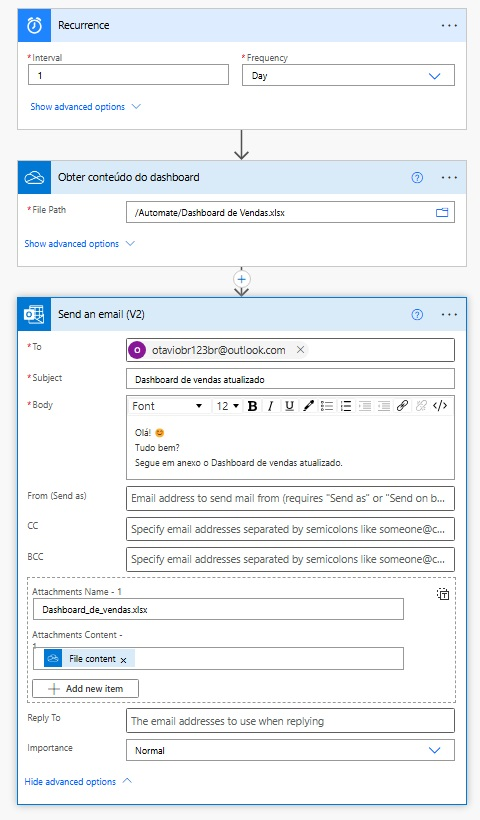
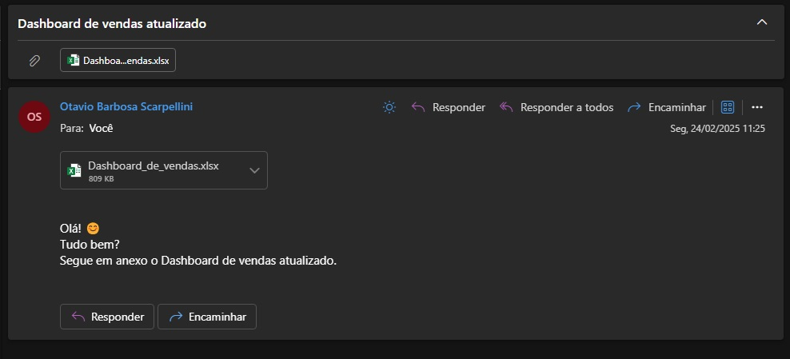
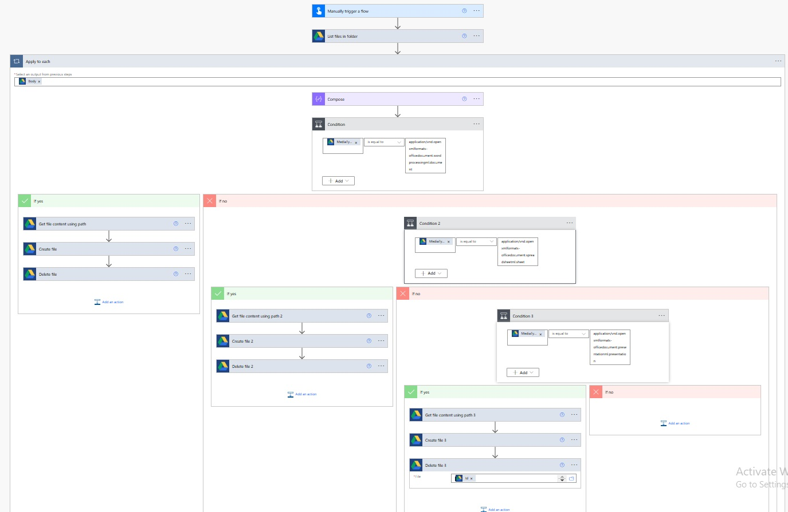

# Power Automate Automations Repository

This project is dedicated to showcasing the various automations I have created using **Power Automate**, to automate repetitive tasks, integrate apps and services, and improve efficiency.

## What’s Inside?

- **Automations**: A collection of workflows built with Power Automate.
- **Examples**: Practical examples demonstrating how automation can save time and improve productivity.
- **Databases**: the files used for data collection.

## Automatic Sales Dashboard update 

 
 - **Explanation**: designed to send a daily email with an update of sales. 

Recurrence

Defines the frequency of the automation.
It is set to run once per day. 

Get dashboard content

Retrieves the specific dashboard file.
This file will be used later as an attachment in the email. 

Send an email

This automation ensures that the recipient receives an updated sales dashboard every day.

 - **Result**: 

## Automatic file sorter 

Further explanation soon

